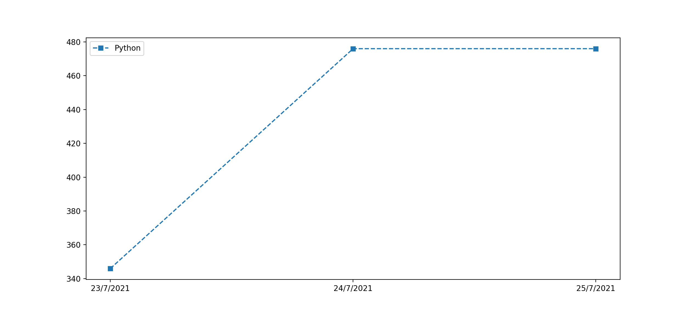

# Repo Plotter

[](https://wakatime.com/badge/github/smsimone/repo_plotter)

Useless script that plots repository stats over time.

It just iterates over all the commits on a specific branch and plots the requested lines of code and/or line of comments.

## Dependencies

This script requires:

- git
- [cloc](https://github.com/AlDanial/cloc)

## How to run

Before all run

```console
$ pip3 install -r requirements.txt
```

to install the needed dependencies.

---

After that you can run the script

```zsh
$ python3 -m plotter --repository "repository_url"
```

and it will generate an image like this:



## Flags

- `--repository <repository_url>`
  - ignored if `--offline` is defined, otherwise required
  - Specifies the repository on which you want to use the script
- `--branch <branch_name>`
  - optional
  - Specifies another branch instead of the default one to run this script on
- `--offline`
  - optional
  - Specifies if the script has to use the pre-downloaded repository (found in .repo folder) or it has to clone it again using `--repository` flag
- `--dir <directory_path>`
  - optional, if not defined it will use `.repo` directory
  - Specifies the temporary directory to use to store the repository defined with the flag `--repository`
- `--input_file <file_path>`
  - optional, if defined it will override `--repository` and `--offline` flags
  - Specifies a custom json file to feed the script. It must has been generated during an old execution
- `--write_output`
  - optional
  - Specifies wether the script has to write the intermediate results to output
- `--output_folder`
  - required if `--write_output` is defined
  - Specifies the folder where the script has to write the output files
- `--no_preprocessing`
  - Doesn't preprocess data. The script will plot all the commits
